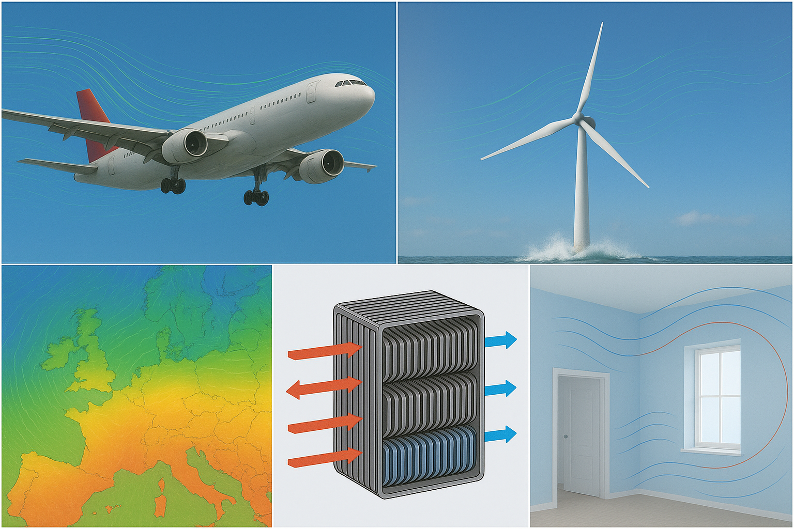

<style>
h1, h2, h3, h4, h5, h6 {
  text-align: left !important;
  margin-top: 0.1em !important;
}
.smaller-text {
  font-size: 0.85em;
}
</style>

**Fluid Mechanics: Lecture 4**
## The Navier-Stokes Equations <br><br>

**Lecturer: Jacob Andersen** <br>
<span class="smaller-text">
*Slides by Asst. Prof. Jacob Andersen (AAU BUILD) and Assoc. Prof. Jakob Hærvig (AAU ENERGY)*
</span>

---
<!-- Slide 2 -->

## Any experience with the Navier-Stokes Equations?


---
<!-- Slide 3 -->

## What are they? 
<ul>
  <li class="fragment">
    Popularly: Very general set of equations describing almost any flow of fluids
  </li>
  <li class="fragment">
    Vast span of applications
  </li>
  <li class="fragment" style="list-style: none; text-align: center;">
    
  </li>
</ul>

---
<!-- Slide 3 -->

## What makes them special?

<ul>
  <li class="fragment">Recall: Potential flow theory (Lecture 3)
    <ul>
      <li class="fragment">Inviscid, irrotational, incompressible flow</li>
    </ul>
  </li>
  <li class="fragment">The most general form of the Navier-Stokes equations 
  </li>
</ul>
<br><br><br><br><br><br><br><br><br><br><br><br><br><br><br><br><span style="display:block; margin-top:1.6em;"></span>
---

## What makes them special?

<ul>
  <li>Recall: Potential flow theory (Lecture 3)
    <ul>
      <li style="opacity:0.3; text-decoration:line-through;">Inviscid, irrotational, incompressible flow</li>
    </ul>
  </li>
  <li>The most general form of the Navier-Stokes equations 
    <ul>
      <li style="background: #ffe5cc; border-radius: 6px; padding: 2px 6px; font-weight: bold;">Viscid, rotational, compressible flow</li>
      <li class="fragment">Huge impact on the complexity of the flow &rarr; <b>Turbulence</b></li>
    </ul>
  </li>
</ul>
<span class="fragment" style="font-size:0.75em; color: #555; display: block; text-align: center;

<span class="fragment" style="display: block; text-align: center;">
  <p> Flow over stalled airfoil</span> </p>
  <iframe width="560" height="315" data-src="https://www.youtube.com/embed/-1h9frhwVEI?autoplay=1&mute=1" src="" allow="autoplay; encrypted-media" allowfullscreen></iframe>
</span>

<script>
  // Helper: Reset iframe source to restart video
  function restartVideo(iframe) {
    const src = iframe.getAttribute('data-src');
    iframe.src = '';           // unload
    setTimeout(() => {         // ensure browser re-requests
      iframe.src = src;
    }, 50);
  }

  // Trigger when a fragment is shown
  Reveal.on('fragmentshown', event => {
    const iframe = event.fragment.querySelector('iframe');
    if (iframe) restartVideo(iframe);
  });

  // Optional: Also restart if you revisit the slide
  Reveal.on('slidechanged', event => {
    event.currentSlide.querySelectorAll('.fragment iframe').forEach(iframe => {
      iframe.src = ''; // clear on slide enter
    });
  });
</script>
<ul>
  <li class="fragment">Note: Incompressibility is still a very accurate assumption used in most engineering applications</li>
</ul>

---
<!-- Slide 4 -->

## Richard Feynman on Turbulence

> Turbulence is the most important unsolved problem of classical physics  
> [Eames & Flor (2011)](https://royalsocietypublishing.org/doi/10.1098/rsta.2010.0332)
<!-- .element: class="fragment" -->

> There is a physical problem that is common to many fields, that is very old, and that has not been solved. It is not the problem of finding new fundamental particles, but something left over from a long time ago—over a hundred years. Nobody in physics has really been able to analyze it mathematically satisfactorily in spite of its importance to the sister sciences. It is the analysis of circulating or turbulent fluids. <br>
> [Feynman et al. (1965)](https://www.goodreads.com/book/show/17278.The_Feynman_Lectures_on_Physics_Vol_1)
<!-- .element: class="fragment" -->
---
<!-- Slide 5 -->
## A Millennium Problem

The Clay Mathematics Institute has identified the existence and smoothness of solutions to the Navier-Stokes equations as one of the seven Millennium Prize Problems.

<ul>
  <li class="fragment"><b>Sketch of the Problem</b> <br>
    Prove or give a counter-example that in 3-D, solutions to the incompressible Navier-Stokes equations always exist and are smooth for all time. <br>
    <a href="https://www.claymath.org/wp-content/uploads/2022/06/navierstokes.pdf">Fefferman (2022)</a>
  </li><br>
  <li class="fragment"><b>Prize</b> <br>
    $1,000,000 for a correct solution.
  </li>
</ul>

---

## We Are Engineers - Why This Lecture?

NSE describes some very complex fundamental physics not fully understood and the mathematical properties of the eqs. are still new territory 

Now, this is an engineering programme, so why are we interested in the Navier-Stokes eqs.? Why this lecture?

We need something much easier to work with - to do large parameters sweeps and testing e.g. buildings for thousands of load cases 

Turns out NSE combined with modern computer power
Very detailed information of very virtually every enginrrtinh flow problems
Numerical models allows for detailed analysis of virtually all flows of engineering interest

---

## Engineering Application 1-4

Examples of Engineering Applications based on Navier-Stokes solvers (CFD)

<!-- In order to do so we must first fully understand governing physics of cases
Given their generality AND accuracy (if treated correct)
The importance of fluid flows for engineering as a broad -->

---

<!-- Slide  -->

<style>
.equation-box {
  border: 2px solid #001d7bff;
  background: #eaf3fb;
  border-radius: 12px;
  min-width: 320px;
  max-width: 700px;
  margin: 0.5em auto;
  padding: 1em 1.5em;
  text-align: left;
  font-size: .5em;
  box-shadow: 0 2px 8px #0001;
}
.equation-arrow {
  text-align: center;
  margin: 0.2em 0 0.2em 2em;
  color: #d35400;
  font-size: .5em;
}
</style>

<div class="equation-box">
  <b>Compressible Navier-Stokes Equations</b>
  $$
  \begin{gathered}
    \frac{\partial\rho}{\partial t} + \nabla\cdot(\rho U) = 0 \\
    \frac{\partial(\rho U)}{\partial t} + \nabla\cdot(\rho UU) = \nabla\cdot\left(\mu(\nabla U+(\nabla U)^\mathrm{T})-\frac{2}{3} \mu(\nabla\cdot U)I_3\right) - \nabla p+\rho g
  \end{gathered}
  $$
</div>
<div class="equation-arrow">
  &darr; &nbsp; <i>&rho; is constant (incompressible flow)</i>
</div>
<div class="equation-box" style="max-width:600px;">
  <b>Incompressible Navier-Stokes Equations</b>
  $$
  \begin{gathered}
    \nabla\cdot U=0\\
    \frac{\partial U}{\partial t}+\nabla\cdot(UU)=\nu\nabla^2 U-\frac{1}{\rho} \nabla p+g
  \end{gathered}
  $$
</div>
<div class="equation-arrow">
  &darr; &nbsp; <i>&mu; = 0 (inviscid flow)</i>
</div>
<div class="equation-box" style="max-width:480px;">
  <b>Euler Equations</b>
  $$
  \begin{gathered}
    \nabla\cdot U=0\\
    \frac{\partial U}{\partial t} + \nabla\cdot(UU)= -\frac{1}{\rho} \nabla p+g
  \end{gathered}
  $$
</div>
<div class="equation-arrow">
  &darr; &nbsp; <i>&nabla; &times;U = 0 (irrotational flow)</i>
</div>
<div class="equation-box" style="max-width:320px;">
  <b>Laplace's Equation</b>
  $$
  \nabla^2 \varphi =0
  $$
</div>

---

<style>
.equation-box {
  border: 2px solid #001d7bff;
  background: #eaf3fb;
  border-radius: 12px;
  min-width: 320px;
  max-width: 700px;
  margin: 0.5em auto;
  padding: 1em 1.5em;
  text-align: left;
  font-size: .5em;
  box-shadow: 0 2px 8px #0001;
}
.equation-arrow {
  text-align: center;
  margin: 0.2em 0 0.2em 2em;
  color: #d35400;
  font-size: .5em;
}
/* Highlight for the second box */
.equation-box.highlight {
  border: 3px solid #d35400;
  background: #ffe5cc;
  box-shadow: 0 0 16px #d3540040;
}
</style>

<div class="equation-box">
  <b>Compressible Navier-Stokes Equations</b>
  $$
  \begin{gathered}
    \frac{\partial\rho}{\partial t} + \nabla\cdot(\rho U) = 0 \\
    \frac{\partial(\rho U)}{\partial t} + \nabla\cdot(\rho UU) = \nabla\cdot\left(\mu(\nabla U+(\nabla U)^\mathrm{T})-\frac{2}{3} \mu(\nabla\cdot U)I_3\right) - \nabla p+\rho g
  \end{gathered}
  $$
</div>
<div class="equation-arrow">
  &darr; &nbsp; <i>&rho; is constant (incompressible flow)</i>
</div>
<div class="equation-box highlight" style="max-width:600px;">
  <b>Incompressible Navier-Stokes Equations</b>
  $$
  \begin{gathered}
    \nabla\cdot U=0\\
    \frac{\partial U}{\partial t}+\nabla\cdot(UU)=\nu\nabla^2 U-\frac{1}{\rho} \nabla p+g
  \end{gathered}
  $$
</div>
<div class="equation-arrow">
  &darr; &nbsp; <i>&mu; = 0 (inviscid flow)</i>
</div>
<div class="equation-box" style="max-width:480px;">
  <b>Euler Equations</b>
  $$
  \begin{gathered}
    \nabla\cdot U=0\\
    \frac{\partial U}{\partial t} + \nabla\cdot(UU)= -\frac{1}{\rho} \nabla p+g
  \end{gathered}
  $$
</div>
<div class="equation-arrow">
  &darr; &nbsp; <i>&nabla; &times;U = 0 (irrotational flow)</i>
</div>
<div class="equation-box" style="max-width:320px;">
  <b>Laplace's Equation</b>
  $$
  \nabla^2 \varphi =0
  $$
</div>

---

# Derivation

---

## Next Step - Solving The Navier-Stokes Equations

<ul>
  <li class="fragment">Navier-Stokes equations can be relatively easily formulated/derived 
  </li><br>
  <li class="fragment">Extremely difficult to solve analytically
  </li><br>
  <li class="fragment">No known accurate analytical solutions to most engineering flows --> Numerical methods for approximate solutions (CFD)
  </li>
</ul>

---

## Engineering Applications

https://www.youtube.com/watch?v=EvSDFRfJToQ 
https://www.youtube.com/watch?v=qEtcCjln-0Q 2:20
https://www.youtube.com/watch?v=0s-dVwlBXqM
https://www.youtube.com/watch?v=y1sSRXFBN7k 1:13

---

## Unordered lists with different indentation

-   aaa
    -   bbb
        -   ccc
            -   ddd
            -   eee
        -   fff
    -   ggg
-   hhh

---

## Mixed lists with different indentation

1. aaa
    - bbb
        1. ccc
            - ddd
                1. eee
                2. test
            - fff
        2. ggg
    - hhh
2. iii

---

## Margins before/after quote

Lorem ipsum dolor sit amet, consectetur adipiscing elit, sed do eiusmod tempor incididunt ut labore et dolore magna aliqua.

> Lorem ipsum dolor sit amet, consectetur adipiscing elit, sed do eiusmod tempor incididunt ut labore et dolore magna aliqua.  
> ~ Someone

Lorem ipsum dolor sit amet, consectetur adipiscing elit, sed do eiusmod tempor incididunt ut labore et dolore magna aliqua.

---

## Margins before/after math

Lorem ipsum dolor sit amet, consectetur adipiscing elit, sed do eiusmod tempor incididunt ut labore et dolore magna aliqua.

$$
S_n(x)=\sum_{k=1}^n \frac{\sin(kx)}{k} \gt 0\quad (n\geq 1,\quad 0 \lt x \lt \pi)
$$

Lorem ipsum dolor sit amet, consectetur adipiscing elit, sed do eiusmod tempor incididunt ut labore et dolore magna aliqua.

---

## Margins before/after table

Lorem ipsum dolor sit amet, consectetur adipiscing elit, sed do eiusmod tempor incididunt ut labore et dolore magna aliqua.

| abc | abc |
| --- | --- |
| xyz | 123 |
| xyz | 123 |

Lorem ipsum dolor sit amet, consectetur adipiscing elit, sed do eiusmod tempor incididunt ut labore et dolore magna aliqua.

---

## Margins before/after image

Lorem ipsum dolor sit amet, consectetur adipiscing elit, sed do eiusmod tempor incididunt ut labore et dolore magna aliqua.


Lorem ipsum dolor sit amet, consectetur adipiscing elit, sed do eiusmod tempor incididunt ut labore et dolore magna aliqua.

---

## Margins before/after code

Lorem ipsum dolor sit amet, consectetur adipiscing elit, sed do eiusmod tempor incididunt ut labore et dolore magna aliqua.

```python
def sum(a, b):
    c = a + b
    return c
```

Lorem ipsum dolor sit amet, consectetur adipiscing elit, sed do eiusmod tempor incididunt ut labore et dolore magna aliqua.

---

## Margins before/after video

Lorem ipsum dolor sit amet, consectetur adipiscing elit, sed do eiusmod tempor incididunt ut labore et dolore magna aliqua.

<iframe width="560" height="315" src="https://www.youtube.com/embed/sGF6bOi1NfA?si=Xolnp5XjGsdLB_8Q" allowfullscreen></iframe>

Lorem ipsum dolor sit amet, consectetur adipiscing elit, sed do eiusmod tempor incididunt ut labore et dolore magna aliqua.

---

## Large code base

```python [10|30|60]
# Knuth-Morris-Pratt (KMP) Algorithm for Pattern Matching

# Function to create the Longest Prefix Suffix (LPS) array
def compute_lps_array(pattern):
    length = 0  # length of the previous longest prefix suffix
    lps = [0] * len(pattern)  # lps[i] is the length of the longest prefix suffix of pattern[0...i]
    i = 1  # Start from the second character of the pattern

    # Loop to calculate lps[i] for i = 1 to len(pattern) - 1
    while i < len(pattern):
        if pattern[i] == pattern[length]:
            length += 1
            lps[i] = length
            i += 1
        else:
            if length != 0:
                length = lps[length - 1]
            else:
                lps[i] = 0
                i += 1
    return lps

# Function implementing the KMP algorithm
def kmp_search(text, pattern):
    # Get the length of text and pattern
    n = len(text)
    m = len(pattern)

    # Preprocess the pattern to compute the lps array
    lps = compute_lps_array(pattern)

    i = 0  # index for text[]
    j = 0  # index for pattern[]

    # List to store the starting indices of pattern matches
    match_positions = []

    while i < n:
        if pattern[j] == text[i]:
            i += 1
            j += 1

        if j == m:
            # Pattern found, record the starting index
            match_positions.append(i - j)
            j = lps[j - 1]  # Reset j using the lps array

        elif i < n and pattern[j] != text[i]:
            # Mismatch after j matches
            if j != 0:
                j = lps[j - 1]
            else:
                i += 1

    return match_positions

# Example usage
if __name__ == "__main__":
    text = "ababcabcabababd"
    pattern = "ababd"

    result = kmp_search(text, pattern)

    if result:
        print(f"Pattern found at indices: {result}")
    else:
        print("Pattern not found in the text.")
```

---

## Single page large image (fit)


---

## Single page small image (fit)


---

## Multicolumn images

<div class="multicolumn">

<div>


</div>

<div>


</div>

<div>


</div>

</div>

---